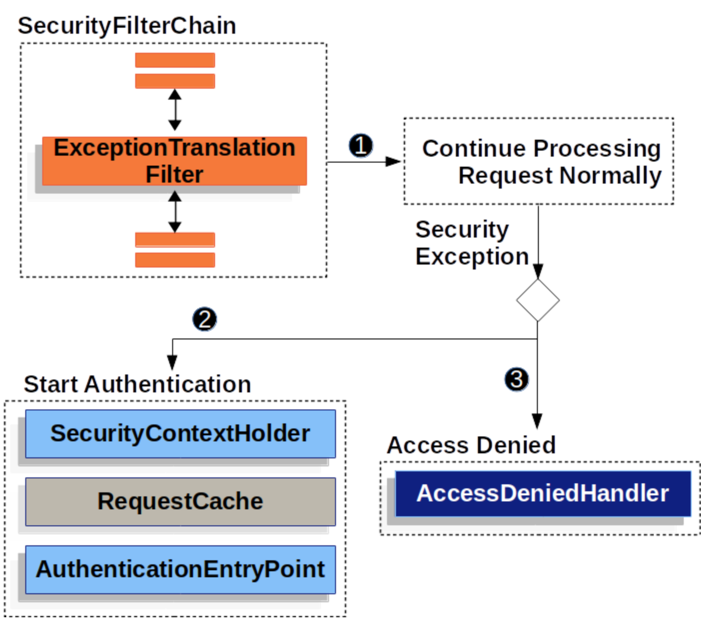

# 스프링 시큐리티 필터 내부에서 발생한 예외는 어떻게 처리되는가?

https://docs.spring.io/spring-security/reference/servlet/architecture.html#servlet-exceptiontranslationfilter
1. First, the ExceptionTranslationFilter invokes FilterChain.doFilter(request, response) to invoke the rest of the application.
2. If the user is not authenticated or it is an AuthenticationException, then Start Authentication.
3. Otherwise, if it is an AccessDeniedException, then Access Denied. The AccessDeniedHandler is invoked to handle access denied.

- 예외 처리 필터가 인증/인가보다 먼저 실행되기 때문에, 인증과 인가 중 발생한 예외를 처리할 수 있음

# 필터에서 발생한 예외를 필터 내부가 아닌 스프링 예외 핸들러에서 처리할 수 있는가?
## 기본적으로는 불가능
  - 스프링 MVC의 @ControllerAdvice, @ExceptionHandler는 DispatcherServlet 이후의 흐름에서만 동작
  - FilterChain -> DispatcherServlet 순으로 동작함
  - 필터에서 발생한 예외는 DispatcherServlet까지 도달하지 않기 때문에 @ExceptionHandler는 호출되지 않음
## 방법 1
- ExceptionTranslationFilter 내부에 CustomHandler 등록
```java
http.exceptionHandling()
    .authenticationEntryPoint(customEntryPoint)
    .accessDeniedHandler(customAccessDeniedHandler);
```

## 방법 2
- 모든 예외를 Controller까지 전달하고 싶다면 필터 안에서 직접 request.setAttribute()로 예외 상태를 넘기고
- /error 등의 경로로 리다이렉트하여 @ControllerAdvice가 동작하게끔 우회적으로 처리해야함

# hasRole과 hasAuthority를 동시에 사용할 수 있나?
## 요청 기반 권한 부여
- 별도의 DSL이 제공되지 않으며, 사용자가 직접 로직을 구성해야함
```java
http
  .authorizeHttpRequests(auth -> auth
    .requestMatchers("/admin/**")
    .access((authentication, context) -> {
        var authn = authentication.get();
        boolean hasUser = authn.getAuthorities().stream()
            .anyMatch(a -> a.getAuthority().equals("ROLE_USER"));
        boolean hasAdmin = authn.getAuthorities().stream()
            .anyMatch(a -> a.getAuthority().equals("ADMIN"));
        return new AuthorizationDecision(hasUser || hasAdmin);
    })
  );
```

## 메서드 기반 권한 부여
- 표현식을 통해 손쉽게 구현할 수 있다.
- 둘의 접두사 처리 방법이 다른 것을 인지하고 써야한다.
  - hasRole("USER") -> "ROLE_USER"
  - hasAuthority("ROLE_USER") -> "ROLE_USER"

```java
@PreAuthorize("hasRole('USER') or hasAuthority('ADMIN')")
public void someMethod() { ... }
```