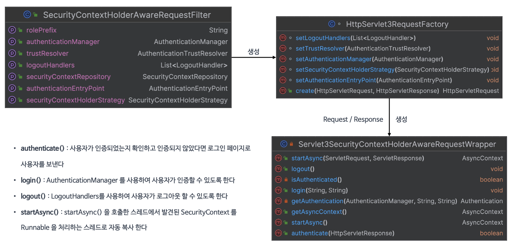
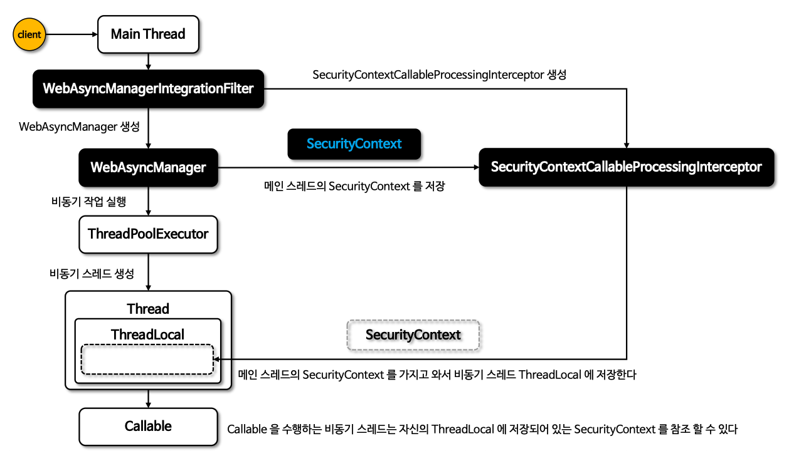

## Servlet API 통합

- 인증 관련 기능들을 필터가 아닌 서블릿 영역에서 처리



- `SecurityContextHolderAwareRequestFilter`
    - HTTP 요청이 처리될 때 `HttpServletRequest`에 보안 관련 메서드를 추가 제공하는 `Wrapper Class`를 적용
- `HttpServlet3RequestFactory`
    - Serlvet과 통합하기 위한 `Servlet3SecurityContextHolderAwareRequestWrapper` 객체를 생성
- `Servlet3SecurityContextHolderAwareRequestWrapper`

```java
// Wapper를 통해 아래와 같이 사용할 수 있게 됨
@GetMapping("...")
public String method(HttpServletRequest request) {
    ...
    request.login(...);
    request.authenticate(...);
    ...
}
```

## Spring MVC 통합

- 메서드 인수에 `@AuthenticationPrincipal`로 Spring Security와 독립적으로 사용 가능

```java
// 기존 Principal을 얻어오기 위한 여정
@RequestMapping("...")
public void findUser() {
    Authentication authentication = SecurityContextHolder
        .getContextHolderStrategy()
        .getContext()
        .getAuthentication();
    CustomUser custom = (CustomUser)authentication == null ? null : authentication.getPrincipal();
}

// Spring MVC 통합
@RequestMapping("/user")
public Customer findUser(@AuthenticationPrincipal CustomUser customUser) {
    ...
}
```

- `Principal`의 내부 객체를 가져올 때, 표현식을 사용할 수 있음

```java
@RequestMapping("/user")
public Customer findUser(@AuthenticationPrincipal(expression="customer") Customer customer) {
    ...
}
```

## Spring MVC 비동기 통합

- 부모 스레드에서 자식 스레드(비동기)를 사용할 때, 자식 스레드에서 사용할 수 있도록 `SecurityContext` 객체를 자식 스레드의 `ThreadLocal`에 저장



- `WebAsyncManagerIntegrationFilter` 
    - `WebAsyncManager` 를 생성하고 `SecurityContextCallableProcessingInterceptor` 를 `WebAsyncManager` 에 등록
- `WebAsyncManager` 
    - 스레드 풀의 비동기 스레드를 생성하고 `Callable` 을 받아 실행시키는 주체
    - `SecurityContextCallableProcessingInterceptor` 를 통해 현재 스레드가 보유하고 있는 `SecurityContext`  객체를 비동기 스레드의 `ThreadLocal` 에 저장

```java
return new Callable<Authentication>() {
    public Authentication call() throws EXception {
        SecurityContext securityContext = SecurityContextHolder.getContextHolderStrategy().getContext();
        Authentication authentication = securityContext.getAuthentication();

        return authentication;
    }
}
```
