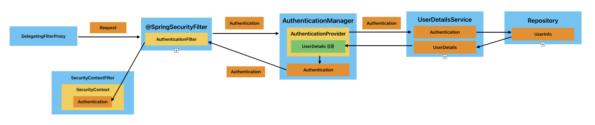

# 인증 아키텍처
1. Authentication
2. SecurityContext
3. SecurityContextHolder
4. AuthenticationManager
5. AuthenticationProvider
6. UserDetailsService
7. UserDetails

> 이 Section에서 채택한 설명 방법  
> - 아키텍처의 Flow를 이해하기 쉽게 설명하는 것을 목표로 함
> - 이에 따라 강의에서 나왔지만, 세부적인 내용은 일부 생략되었을 수 있음

## 인증 아키텍처 흐름

1. `DelegatingFilterProxy` 는 요청을 가로채서 `FilterChainProxy` ( `@SpringSecurityFilterChain`  Bean)에게 넘긴다.
2. 요청 방식에 따라 이전 Section에서 공부했던 적절한 `AuthenticationFilter` 구현체를 선택하고, `Authentication`  인증 토큰을 생성한다. 그리고 `AuthenticationManager` 에게 위임한다.
    - `Authentication` 은 인터페이스로, 다음과 같은 구현체들이 존재
        - `UsernamePasswordAuthenticationToken`  : 폼 로그인 기반
        - `BearerTokenAuthenticationToken`  : OAuth2 혹은 JWT
        - `RememberMeAuthenticationToken` 
        - `AnonymousAuthenticationToken` 
3. `AuthenticationManager` 는 받은 `Authentication` 을 처리하기 적절한 `AuthenticationProvider` 를 찾아서, 처리를 위임한다.
    - 적절한 `AuthenticationProvider` 
        - `Form`  → `DaoAuthenticationProvider` 
        - `HttpBasic`  → `BasicAuthenticationProvider` 
        - `RememberMe`  → `RememberMeAuthenticationProvider` 
        - `OAuth2`  → `OAuth2AuthenticationProvider` 
    - 가지고 있는 `AuthenticationProvider` 중에 처리할 수 있는 요소가 없다면, 부모(`parent` )에게 처리를 위임
    - 처리할 수 있는 `AuthenticationProvider` 를 찾지 못하면, `ProviderNotFoundException` 
4. `AuthenticationProvider` 는 받은 `Authentication` 의 정보를 사용하여 `UserDetailService` 에게 사용자 정보를 가져오라고 위임한다.
5. `UserDetailsService` 는 DB 등 저장소에서 사용자 정보를 `UserInfo` 형태로 로드하고, `UserDetails`  형태로 변환하여 `AuthenticationProvider` 에게 반환한다.
    - 사용자 정보가 존재하지 않으면 `UserNotFoundException` 
6. `AuthenticationProvider` 는 받은 `UserDetails` 에 대해 실제 인증을 수행한다.
    - `PasswordEncoder` 를 통해 비밀번호를 검증
    - 계정이 유효한지, 잠금되어있는지 등을 체크
7. 인증이 정상적으로 수행되면, `AuthenticationProvider` 는 인증된 정보를 바탕으로 새로운 `Authentication` 을 만들고, `AuthenticationMananger` 에게 반환한다.
8. `AuthenticationManager` 는 이 `Authentication` 을 처음 호출했던 `AuthenticationFilter` 로 넘긴다.
9. 이 넘겨진 `Authentication` 은 `SecurityContext` 에 저장이 되고, 최종적으로 `SecurityContextHolder` 에 저장이 된다.
    - `SecurityContext` 는 `ThreadLocal` 에 저장된다. → 애플리케이션 전반에 걸쳐 확인 가능
    - `SecurityContextHolder` 는 `SecurityContext` 를 관리할 전략을 공통적이고 효율적으로 관리
        - `MODE_THREADLOCAL`  : 각 스레드가 독립적인 보안 컨텍스트를 가짐 (주로 사용)
        - `MODE_INHERITABLETHREADLOCAL`  : 부모 → 자식 스레드로 보안 컨텍스트가 상속
            - 작업을 스레드간 분산 실행할 때 유용
        - `MODE_GLOBAL`  : 전역적으로 단일 보안 컨텍스트를 사용
