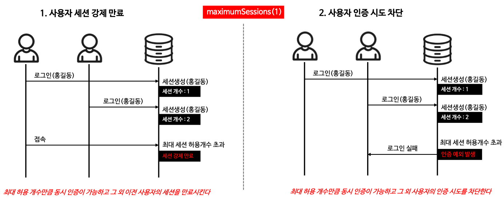
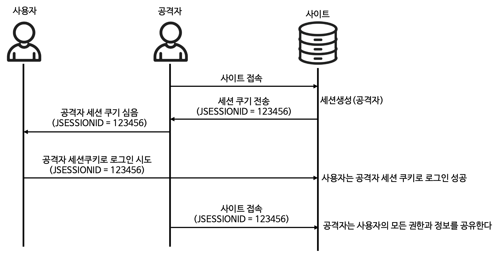
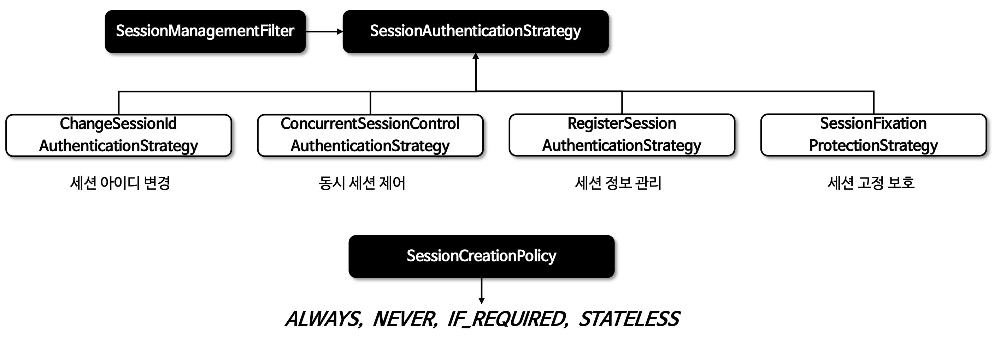
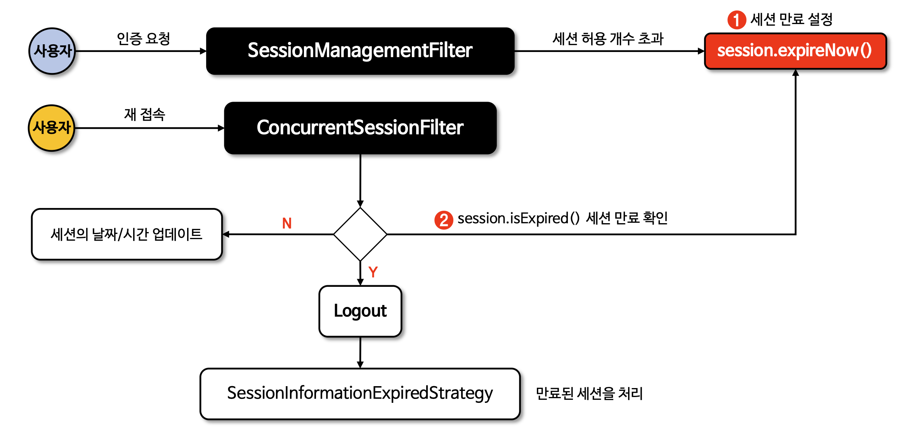
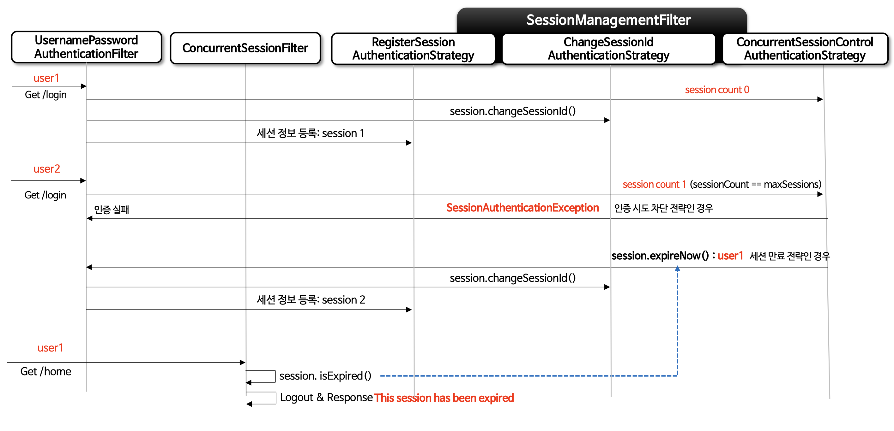

# Section 6. 세션 관리
## 동시성 제어
- 여러 클라이언트가 동시에 하나의 계정으로 로그인할 때 세션의 동시적 개수를 제한
- `.sessionManagement()`를 통해 설정
- 유형
  1. 기존 로그인했던 사용자의 세션을 강제로 만료 (기본값)
     - `.maxSessionsPreventsLogin(false)`
  2. 새롭게 로그인한 사용자의 세션을 거부
     - `.maxSessionsPreventsLogin(true)`



- 옵션
  - `.invalidSessionUrl("/url")` : 만료된 세션으로 요청하는 사용자를 `"/url"`로 리다이렉트
  - `.maximumSessions(N)` : 사용자당 제어할 최대 세션 수(기본값은 무한)
  - `.maxSessionsProventsLogin()`
  - `.expiredUrl("/expired")` : 세션을 만료하고 나서 리다이렉트할 URL로 `"/expired"`를 지정

```java
@Bean
public SecurityFilterChain securityFilterChain(HttpSecurity http) {
    http.sessionManagement(session -> session
        .invalidSessionUrl("/url")
        .maximumSession(1)
        .maxSessionPreventsLogin(true)
        .expiredUrl("/expired")
    );

    return http.build();
}
```

> invalidSessionUrl과 expiredUrl의 차이
>
> - invalidSessionUrl은 세션 타임아웃, 유효하지 않은 세션 등
>
> - expiredUrl은 동시성 제어에 의한 강제 세션 만료
>
> - 보통 우선순위는 invalidSessionUrl이 높음


## 세션 고정 보호
- 세션 고정 공격 : 공격자의 세션ID를 심어 로그인하게 한 후, 해당 세션ID를 사용하는 공격
- `sessionManagement().sessionFixation()`을 통해 설정



```java
@Bean
public SecurityFilterChain securityFilterChain(HttpSecurity http) {
    http.sessionManagement((session) -> session
        .sessionFixation(sessionFixation -> sessionFixation.newSession()));

    return http.build();
}
```

### 세션 고정 보호 "전략"
- `.changeSessionId()`
  - 사용자가 로그인에 성공하면, HTTP세션의 ID만 변경 (기본값)
  - 세션의 ID가 변경되므로, 세션 고정 공격에서 보호 됨
  - 가장 효율적이고, 권장
- `.newSession()` 
  - 사용자가 로그인에 성공하면, 기존 세션을 완전히 무효화
  - 완전히 새로운 빈 세션을 생성
  - 기존 세션에 저장된 데이터들이 사라짐
- `.migrateSession()` 
  - 사용자가 로그인에 성공하면, 새로운 세션을 생성하고 기존 세션의 속성을 복제
- `.none()`
  - 세션 고정 보호 비활성화
  - 권장되지 않음

## 세션 생성 정책
- 세션을 생성하는 정책들을 결정

### 정책

```java
@Bean
public SecurityFilterChain securityFilterChain(HttpSecurity http) {
    http.sessionManagement((session) -> session
        .sessionCreationPolicy(SessionCreationPolicy.STATELESS));

    return http.build();
}
```

- `SessionCreationPolicy.ALWAYS`
  - 요청이 들어올 때마다 항상 새로운 HTTP 세션 생성
  - 이미 세션이 존재하더라도, 새 새션을 만들고 이전 세션을 무효화
  - 항상 세션을 통해 인증 상태를 관리해야 할 때 사용
  - 가장 보수적
- `SessionCreationPolicy.NEVER`
  - 세션을 새로 생성하진 않지만, 이미 생성한 세션은 사용 가능
  - 다른 모듈에 의해 세션이 관리되고 있을 때 사용
- `SessionCreationPolicy.IF_REQUIRED`
  - 필요한 경우에만 세션을 생성
  - 현재 요청을 처리하는 데 세션이 꼭 필요한 경우가 아니라면, 생성하지 않음
  - 불필요한 서버 자원을 줄여 성능에 좋음
- `SessionCreationPolicy.STATELESS`
  - 세션을 전혀 생성하지 않고, 이미 존재하는 세션도 사용하지 않음
  - `JWT` 같이 세션을 사용하지 않을때 유용
  - 서버가 클라이언트의 상태를 유지하지 않으므로, 서버의 확장성이 향상

## SessionManagementFilter
- 사용자의 인증 상태를 감지하고, "세션 인증 전략"을 호출
  - "세션 인증 전략" : 사용자가 성공적으로 인증되었을 때 세션과 관련된 동작을 정의하고 실행
- 세션 인증 전략과, 세션 생성 정책을 관리



## ConcurrentSessionFilter
- 요청에 대해 `SessionRegistry`에서 `SessionInformation`을 검색하고, 세션 만료 시 만료로 표시한 후 로그아웃 처리
- 요청 시 `SessionRegistry.refreshLastRequest()`를 호출하여 세션들의 시간을 업데이트



> SessionManagementFilter와 ConcurrentSessionFilter의 차이?
>
> SessionManagementFilter : 인증 시점에 세션의 초기 상태 설정
>
> ConcurrentSessionFilter : 인증 후 각 요청마다 세션을 지속적 확인

## 사례 흐름도

