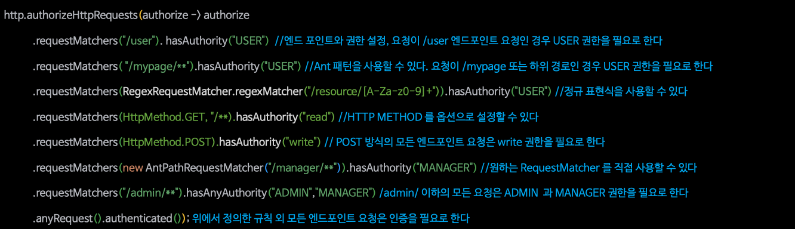
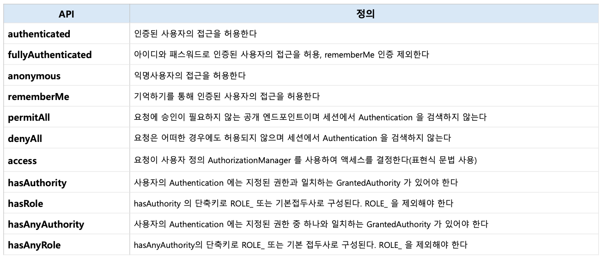

# Section 9. 인가 프로세스
## 요청 기반 권한 부여 - HttpSecurity.authorizeRequests()
- `HttpServletRequest`에 대한 권한 부여
- `authorizeHttpRequests()`를 사용
  - 요청 엔드포인트와 접근에 필요한 권한을 매핑시키기 위한 규칙을 설정
- 요청에 대한 권한 규칙을 설정하면 내부적으로 `AuthorizationFilter`가 요청에 대한 권한 검사 및 승인 작업 수행

```java
@Bean
SecurityFilterChain defaultSecurityFilterChain(HttpSecurity http) {
    http.authorizeHttpRequests(authorize -> authorize
        .anyRequest().authenticated());
        // (모든 요청에 대해).(인증이 되어야 함)

    return http.build();
}
```

### requestMatchers()
- 요청에 대한 보안을 세밀하게 적용
- `.requestMatchers(String... urlPatterns)`
  - 보호가 필요한 자원을 N개 정의
- `.requestMatchers(RequestMatcher... requestMachers)`
  - `AntPathRequestMatcher`, `MvcRequestMatcher` 등의 구현체를 사용하여 보호가 필요한 자원을 N개 정의
- `.requestMatchers(HttpMethod method, String... urlPatterns)`
  - HttpMethod와 보호가 필요한 자원을 N개 정의
- `.hasRole()`을 사용하여 필요 권한 정의 
  - ex. `requestMatchers("/admin").hasRole("ADMIN")`
    - "보호해야 할 자원"은 "특정 권한"이 필요


- 순서대로 처리되므로, 순서대로 조회 중 조건에 걸릴경우 이후 조건은 검사하지 않음
  - 따라서 좁은 범위의 경로를 먼저 정의하고, 그 뒤에 그것보다 큰 범위를 정의



> `hasRole()`과 `hasAuthority()`의 차이
>
> - `hasRole()`은 "ROLE_" 접두사를 자동으로 붙여서 검사하기에, 명확한 역할이 필요 (따라서 "ROLE_" 접두사를 붙이면 안됨)
>
> - `hasAuthority()`는 "ROLE_"접두사를 붙이지 않기 때문에 유연

## 표현식 및 커스텀 권한 구현
- `WebExpressionAuthorizationManager`를 통해 표현식으로 권한 규칙을 설정

```java
requestMatchers("/admin/{name}").access(new WebExpressionAuthorizationManager("#name == authentication.name"))

requestMatchers("/admin/db").access(new WebExpressionAuthorizationManager("hasAuthority('DB') or hasRole('ADMIN')"))

// same
requestMatchers("/admin/db").access(anyOf(hasAuthority("db"), hasRole("ADMIN")))
```

### Custom 권한 표현식 구현

```java
SecurityFilterChain defaultSecurityFilterChain(HttpSecurity http, ApplicationContext context) {
    // 이 핸들러가 표현식 구문을 처리
    DefaultHttpSecurityExpressionHandler expressionHandler = new DefaultHttpSecurityExpressionHandler();
    expressionHandler.setApplicationContext(context);

    WebExpressionAuthorizationManager expressManager = new WebExpressionAuthorizationManager("@customWebSecurity.check(authentication, request)");
    expressionManager.setExpressionHandler(expressionHadler);

    // AuthorizationManager를 등록
    http.authorizeHttpRequests(authorize -> authorize
        .requestMatchers("/resource/**").access(expressionManager));

    return http.build();
}

@Component("customWebSecurity")
public class CustomWebSecurity {
    // 클래스명과 메서드명은 아무렇게나 만들어도 됨
    public boolean check(Authentication authentication, HttpServletRequest request) {
        return authentication.isAuthenticated();
    }
}
```

### Custom RequestMatcher 구현

```java
public class CustomRequestMatcher implements RequestMatcher {
    private final String urlPattern;
    public CustomRequestMatcher(String urlPattern) {
        this.urlPattern = urlPattern;
    }

    @Override
    public boolean matches(HttpServletRequest request) {
        String requestURI = request.getRequestURI();
        return requestURI.startsWith(urlPattern);
    }
}
```

## 요청 기반 권한 부여 - HttpSecurity.securityMatcher()
- 특정 패턴에 해당하는 요청에만 보안 규칙(엔드포인트에 대한 규칙)을 적용
- 중복해서 사용할 경우 마지막에 설정한 것으로 대체
- `securityMatcher(String... urlPatterns)`
- `securityMatcher(RequestMatcher... requestMatchers)`
- `SecurityFilterChain`은 `RequestMatcher`와 `Filter`를 들고 있는데, `RequestMatcher`에 부합해야 `Filter`가 수행 됨

```java
// 단일 패턴
http.securityMatcher("/api/**").authorizeHttpRequests(auth -> auth.requestMatchers(...))
```

```java
// 다중 패턴 1
http.securityMatchers((matchers) -> matchers.requestMatchers("/api/**", "/oauth/**"));

// 다중 패턴 2
http.securityMatchers((matchers) -> matchers.requestMatchers("/api/**").requestMatchers("/oauth/**"));

// 다중 패턴 3
http.securityMatchers((matchers) -> matchers.requestMatchers("/api/**"))
    .securityMatchers((matchers) -> matchers.requestMatchers("/oauth/**"));
```

## 메서드 기반 권한 부여
- 메서드 수준으로 권한을 부여
- 사용하려면 `@EnableMethodSecurity` 어노테이션을 설정클래스에 사용해야 함
- 커스텀으로 표현식을 만들어 사용할 수 있음
```java
@EnableMethodSecurity
@Configuration
public class SecurityConfig {
  ...
}
```

### @PreAuthorize
- 메서드가 실행되기 전 특정 보안이 충족되는지 확인
  - 권한에 맞지 않을 경우 `AccessDeniedException`
```java
@PreAuthorize("hasAuthority('ROLE_ADMIN')")
public void adminOnlyMethod() {}
```

```java
@PreAuthorize("hasAnyAuthority('ROLE_ADMIN', 'ROLE_USER')")
public void adminOrUserMethod() {}
```

```java
@PreAuthorize("isAuthenticated()")
public void authenticatedUserOnlyMethod() {}
```

```java
@PreAuthorize("#id == authentication.name")
public void userSpecificMethod(String id) {}
```

### @PostAuthorize
- 메서드 실행된 후 특정 보안 조건을 검사
  - 권한에 맞지 않을 경우 `AccessDeniedException`
```java
@PostAuthorize("returnObject.owner == authentication.name")
public BankAccount getAccount(Long id) {
  return new BankAccount();
}
```

```java
@PostAuthorize("hasAuthority('ROLE_ADMIN') and returnObject.isSecure")
public BankAccount getSecureAndAdminAccount(Long id) {
  return new BankAccount();
}
```

```java
@PostAuthorize("returnObject != null and (returnObject.status == 'APPROVED' or hasAuthority('ROLE_ADMIN'))")
public BankAccount updateRequestStatus() {
  return new BankAccount();
}
```

### @PreFilter
- 메서드가 실행되기 전 전달된 컬렉션 타입의 파라미터에 대해 필터링
```java
@PreFilter("filterObject.owner == authentication.name")
public Collection<BankAccount> updateAccounts(BankAccount[] data) {
  return data;
}
```

```java
@PreFilter("filterObject.owner == authentication.name")
public Collection<BankAccount> updateAccounts(Collection<BankAccount> data) {
  return data;
}
```

```java
@PreFilter("filterObject.value.owner == authentication.name")
public Collection<BankAccount> updateAccounts(MAp<String, BankAccount> data) {
  return data;
}
```

```java
@PreFilter("filterObject.owner == authentication.name")
public Collection<BankAccount> updateAccounts(Stream<BankAccount> data) {
  return data;
}
```

### @PostFilter
- 메서드가 반환하는 컬렉션에 대해, 보안조건 필터링
```java
@PostFilter("filterObject.owner == authentication.name")
public List<BankAccount> readAccounts() {
  return dataService.readList();
}
```

```java
@PostFilter("filterObject.value.owner == authentication.name")
public Map<String, BankAccount> readAccounts() {
  return dataService.readMap();
}
```

### @Secured
- 지정된 권한을 가진 사용자만 해당 메서드를 호출할 수 있게 함
  - 현재는 더 넓게 사용할 수 있는 `@PreAuthorize`를 권장
- `@EnableMethodSecurity(securedEnabled=true)`를 활성화 해야 함
```java
@Secured("ROLE_USER")
public void performUserOperation() {

}
```

### JSR-250
- `@RolesAllowed`, `@PermitAll`, `@DenyAll`이 활성화
- `@EnableMethodSecurity(jsr250Enabled=true)`를 활성화 해야 함
  - 표준 기반이므로 학습곡선을 피하고 싶을 때 쓰면 된다고 함
```java
// ROLE_USER 권한을 가진 사용자만 접근할 수 있음
@RolesAllowed("USER")
public void editDocument() {
}
```

```java
// 모든 사용자가 접근할 수 있음
@PermitAll
public void viewDocument() {
}
```

```java
// 어떠한 사용자도 접근할 수 없음
@DenyAll
public void hiddenMethod() {
}
```

### 메타 주석 사용
- 특정 권한에 대한 어노테이션을 간소화 하여 사용
```java
@Target({ ElementType.METHOD, ElementType.TYPE })
@Retention(RetentionPolicy.RUNTIME )
@PreAuthorize("hasRole('ADMIN')")
public @interface IsAdmin {}
```

```java
@Target({ ElementType.METHOD, ElementType.TYPE })
@Retention(RetentionPolicy.RUNTIME )
@PostAuthorize("returnObject.owner == authentication.name")
public @interface RequireOwnership {}
```

### 특정 주석 활성화
- `@PreAuthorize`, `@PostAuthorize`, `@PreFilter`, `@PostFilter` 기능을 끄고, 특정 기능만 활성화 가능
```java
@EnableMethodSecurity(prePostEnabled = false)
class MethodSecurityConfig {
  @Bean
  @Role(BeanDefinition.ROLE_INFRASTRUCTURE)
  Advisor postAuthorize() {
    return AuthorizationManagerAfterMethodInterceptor.postAuthorize();
  }
}
```

### 커스텀 빈을 사용하여 표현식 구현
```java
@GetMapping("/delete")
@PreAuthorize("@authorizer.isUser(#root)") // 여기서 `#root`는 현재 사용자의 보안 컨텍스트
public void delete() {
  System.out .println("delete");
}
```

```java
@Component("authorizer")
class MyAuthorizer {
  public boolean isUser(MethodSecurityExpressionOperations root) {
    boolean decision = root.hasAuthority("ROLE_USER");
    return decision;
  }
}
```

### 클래스 레벨 권한 부여
- 모든 메서드는 클래스 수준의 권한 처리 동작을 상속
  - 메서드에 따로 있다면, 더 자세한 수준의 권한을 사용
```java
@Controller
@PreAuthorize("hasAuthority('ROLE_USER')")
public class MyController {
  @GetMapping("/endpoint")
  public String endpoint() { ... }
}
```

## 정적 자원 관리
- `RequestMatcher` 인스턴스를 등록하여 무시해야 할 요청을 지정
- 정적자원에 대해 특정 엔드포인트가 보안 필터를 거치지 않도록 설정
  - `webSecurity.ignoring()`을 사용하면 `Spring Security`를 거치지 않고 바로 `ApplicationContext`로 들어옴
```java
@Bean
public WebSecurityCustomizer webSecurityCustomizer() {
  return (webSecurity) -> {
    webSecurity.ignoring().requestMatchers(PathRequest.toStaticResources().atCommonLocations());
  };
}
```
- `.ignoreing()`보다는 아래와 같은 사용이 권장
  - 현재는 `permitAll()`의 성능이 개선 됨
  - `Spring Security`의 `Filter`를 거치는게 보안적으로 유리함
```java
http.authorizeHttpRequests(auth -> auth
  .requestMatchers("/css/**", "/images/**", "/js/**", "/webjars/**", "/favicon.*", "/*/icon-*").permitAll()
  .requestMatchers(PathRequest.toStaticResources().atCommonLocations()).permitAll()
  .anyRequest().authenticated());
```

## 계층적 권한
- `Spring Security`는 권한을 문자열로 받기 때문에, 기본적으로 상하 관계 구분 X
- `RoleHirerachy`로 역할 간 계층 구조를 정의하고 관리하는데 사용
  - `getReachableGrantedAuthorities`를 통해 도달 가능한 권한의 배열을 받을 수 있음
```java
@Bean
static RoleHierarchy roleHierarchy() {
  RoleHierarchyImpl hierarchy = new RoleHierarchyImpl();
  hierarchy.setHierarchy("ROME_ADMIN > ROLE_MANAGER\n" +
    "ROLE_MANAGER > ROLE_USER\n" +
    "ROLE_USER > ROLE_GUEST"
  );
  return hierarchy;
}
```
